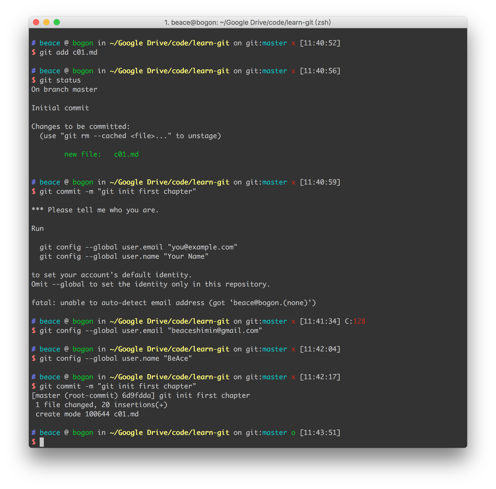

# Git

### git 基础操作

1. 初始化一个仓库

```
git init
```

2. 添加文件

```
git add c01.md
```

3. 通知修改及修改内容

```
git commit -m "git init first chapter"
```

4. git confit

```
git config --global user.email "yourexample@email.com"

git config --global user.name "your git account name"

```

### Screenshot

