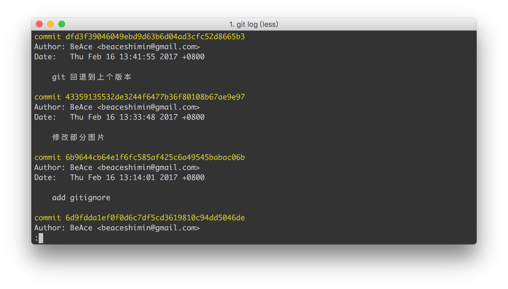
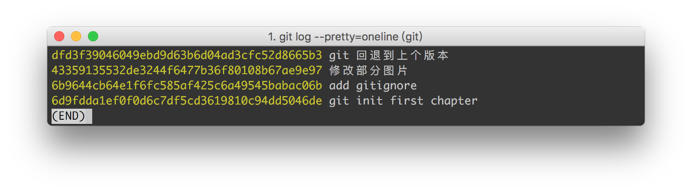
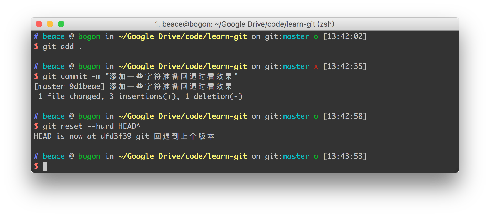

# Git

## 版本的回退与前进

- 查看commit
```
git log
git log --pretty=oneline
```

#### screenshot




- 回退到上一个commit

```
git reset --hard HEAD^

//回退到上上个commit
git reset --hard HEAD^^

//回退到上N个commit
git reset --hard HEAD~N
```

#### screenshot


