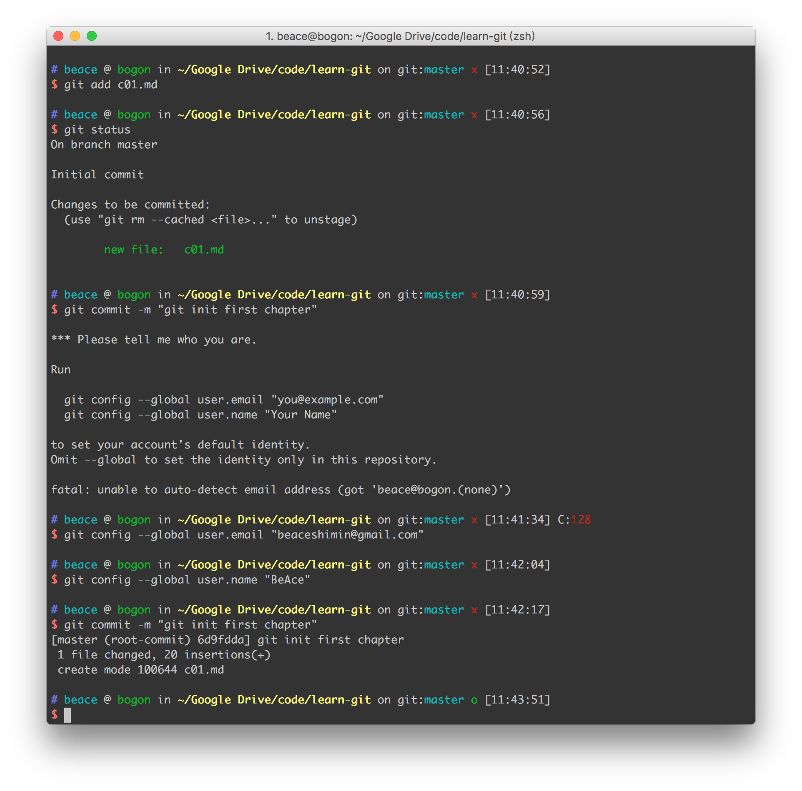
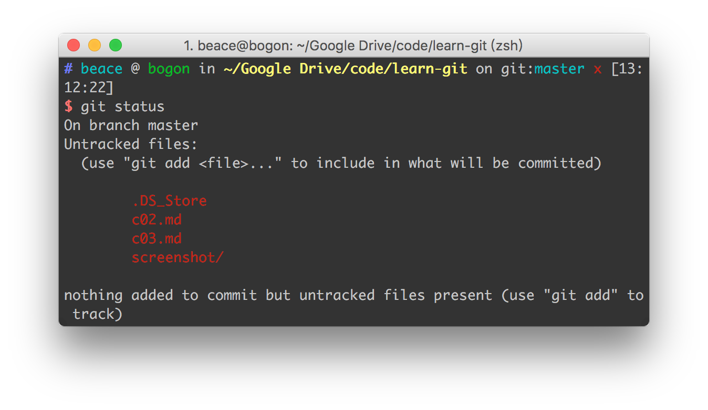

# Git

### git 基础操作

1. 初始化一个仓库

```
git init
```

2. 添加文件

```
git add c01.md
```

3. 通知修改及修改内容

```
git commit -m "git init first chapter"
```

4. git confit

```
git config --global user.email "yourexample@email.com"

git config --global user.name "your git account name"

```

### Screenshot




#### 添加 .gitignore 

如果在Mac下新建项目或者复制项目，会产生这样的文件


这样的文件是项目中不需要的，可以在`git`上传代码之前忽略掉。

```
vi .gitignore
//.gitignore
.DS_Store
```

再次查看git状态

```
git status
```

