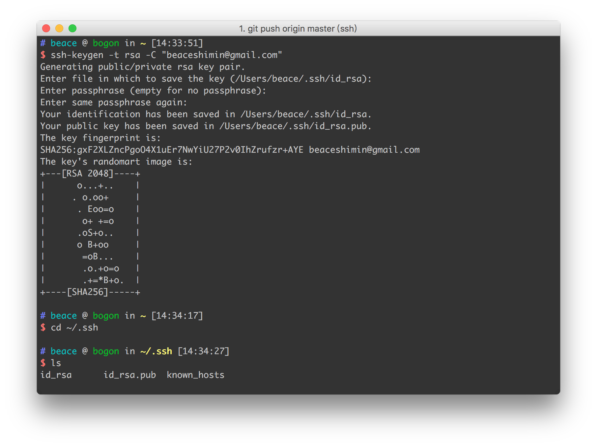

# Git

## git ssh generator

```
ssh-keygen -t rsa -C "beaceshimin@gmail.com"
```

一路回车。。。

#### screenshot



## 如何让本地git项目与远程github.com扯上关系


```
git remote add origin git@github.com:BeAce/doc-git.git
```